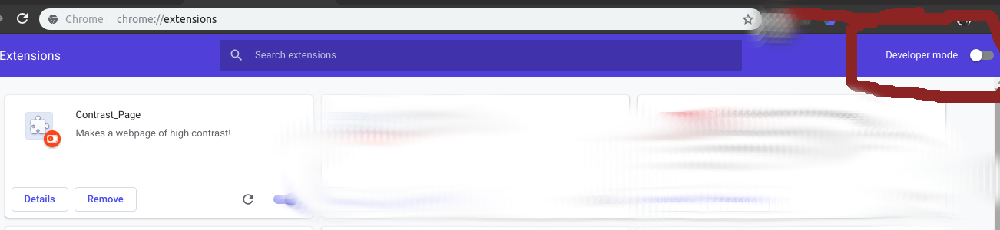
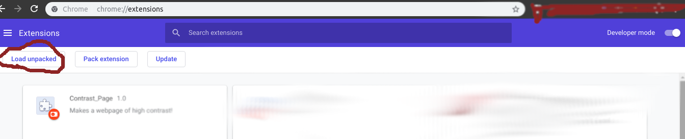

# deClutter (Description)
A google-chrome browser extension that allows to remove the unwanted elements of the web-pages. It gives you a personalised version of the website :-). And can remember the elements marked unwanted by the user (to be implemented).

## Installation
  - Clone or donwload this repository
  - Open extensions tab in google-chrome browser `chrome://extensions`
  - Turn developer mode on if it's not
  - Now click on 'Load unpacked' button and select the folder that you recently cloned / downloaded

  ## Installation
  ### 1. On Linux
  - [Download](https://github.com/Ujjwal0501/deClutter/raw/master/dist/deClutter.crx) the packed extension.
  - Open extensions tab in google-chrome browser `chrome://extensions`
  - Turn developer mode on if it's not
  - You need to refresh the browser page after enabling developer mode
  - Now simply drag and drop the downloaded .crx file and confirm the prompt

  ### 2. On Windows
  - Clone or [download](https://github.com/Ujjwal0501/deClutter/archive/master.zip) this repository
  - Extract the contents of the downloaded `.zip` file
  - Open extensions tab in google-chrome browser `chrome://extensions`
  - Turn developer mode on if it's not
  - Now click on 'Load unpacked' button and locate the `src` folder inside the folder that you recently extracted.

